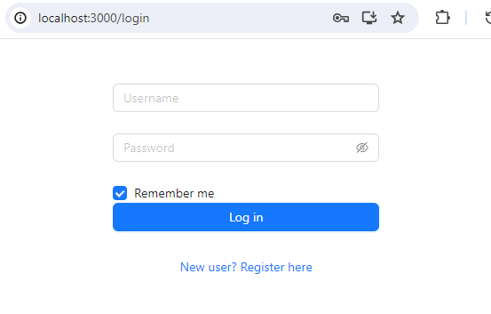
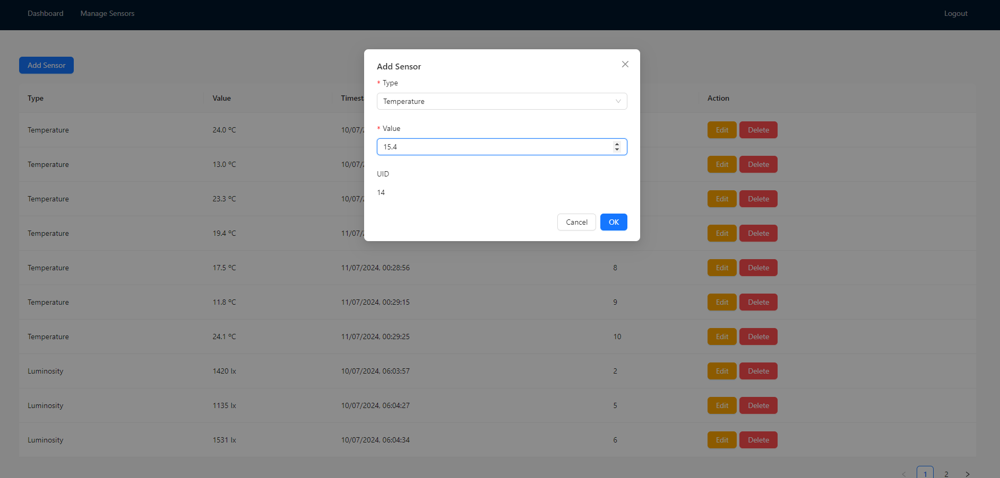
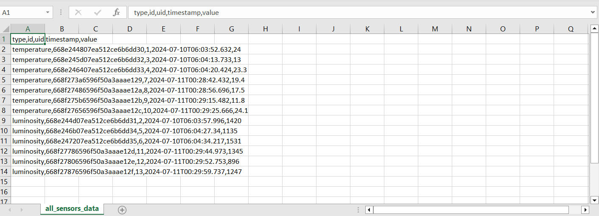

# Sensor API Management Application

## Project Overview

The Sensor API Management Application is a full-stack solution for managing sensor data. It includes a backend API to handle sensor data and a frontend interface for user interaction. The application supports user registration and login, displays statistics for temperature and luminosity sensors, and provides functionalities to export sensor data to CSV files. Additionally, it includes a sensor management page for adding, editing, and deleting sensor records.

## Features

1. **User Authentication**: 
   - User registration and login.
   - Token-based authentication using OAuth2.
   - Secure storage of tokens in localStorage.

2. **Dashboard**:
   - Displays statistics (minimum, maximum, average, and standard deviation) for temperature and luminosity sensors.
   - Option to export data (temperature, luminosity, or both) to CSV files.

3. **Sensor Management**:
   - Add new sensors with automatic UID and timestamp.
   - Edit and delete existing sensors.

4. **Backend API**:
   - Handles RESTful requests for sensor data.
   - Asynchronous messaging with RabbitMQ.
   - Synchronous communication using Feign clients.

## Technologies Used

- **Backend**:
  - Java
  - Spring Boot
  - Spring Data MongoDB
  - Spring Security and OAuth2
  - RabbitMQ for asynchronous messaging
  - Feign for synchronous communication
  - Swagger for API documentation

- **Frontend**:
  - JavaScript
  - React
  - Ant Design for UI components
  - Axios for API calls

- **Database**:
  - MongoDB

- **Containerization**:
  - Docker
  - Docker Compose

## Project Structure

- **Backend**: Located in the **`Backend`** directory.
- **Frontend**: Located in the **`Frontend`** directory.

## Setup Instructions

### Prerequisites

- Docker and Docker Compose installed on your system.

### Cloning the Repository

1. Clone the repository with submodules:

    ```bash
    git clone --recurse-submodules https://github.com/NunoSousa9/Sensor_API.git
    ```

2. Navigate to the project directory:

    ```bash
    cd Sensor_API
    ```

### Running the Application

1. Start the services using Docker Compose:

    ```bash
    docker-compose up --build
    ```

2. Access the application:
   - Backend API: **`http://localhost:8080`**
   - Frontend: **`http://localhost:3000`**


### Usage

1. **Register a new user**:
   - Go to the registration page at **`http://localhost:3000`** and create a new account.

2. **Login**:
   - Use the registered credentials to log in.
   - The token will be stored in localStorage.
  
   


3. **Dashboard**:
   - View statistics for temperature and luminosity sensors.
   - Export sensor data to CSV files.
  
   
5. **Sensor Management**:
   - Add new sensors with auto-generated UID and server timestamp.
   - Edit or delete existing sensors.

   


### Accessing RabbitMQ Management

- RabbitMQ Management interface is available at **`http://localhost:15672`**.
- Default username: **`guest`**
- Default password: **`guest`**

### Accessing MongoDB

- MongoDB is accessible at **`mongodb://localhost:27017`**.
- You can connect using MongoDB Compass or the Mongo shell:
  - **MongoDB Compass**: Use the connection string **`mongodb://localhost:27017`**.
  - **Mongo Shell**: Run **`mongo --host localhost --port 27017`**.
 
### Example of CSV Download

- Export data to a CSV file from the dashboard.

   

## API Documentation

- Access the Swagger API documentation at **`http://localhost:8080/swagger-ui.html`** for detailed information about the available endpoints and their usage.
- Sensor data available at **`http://localhost:8080/sensors/*`**.
